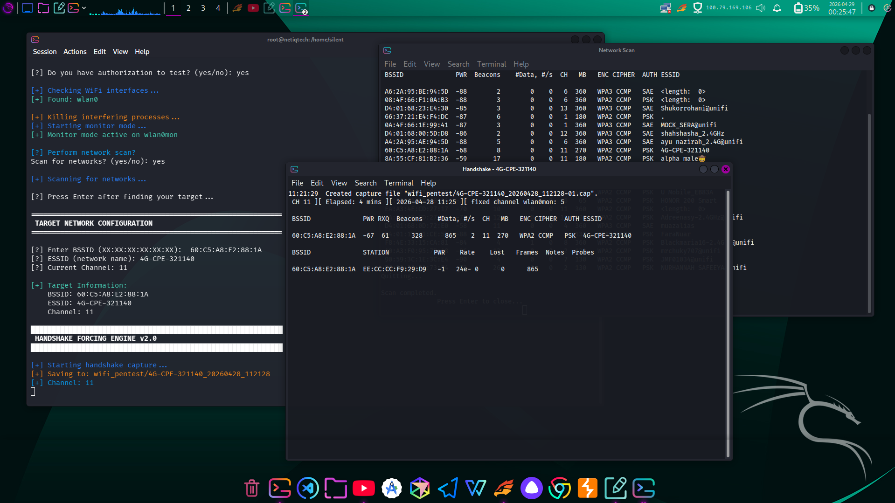

# ⚡ SkyCrack

> Advanced WiFi Security Assessment Framework for Authorized Penetration Testing

<p align="center">
  
</p>

<p align="center">
  <b>Automated • Powerful • Minimal • Offensive Security Tooling</b>
</p>

---

<p align="center">
  
  
  
  
</p>

---

## ⚠️ Disclaimer

> This tool is intended strictly for **authorized security testing and educational use only**.

- You **must** have permission before testing any network  
- Unauthorized access is illegal  
- The developer is **not responsible** for misuse  
- Use responsibly and ethically  

---

## 🧠 Overview

**SkyCrack** is a lightweight yet powerful WiFi penetration testing framework designed to automate the full attack chain:

- Interface detection  
- Monitor mode setup  
- Network reconnaissance  
- Client targeting  
- Handshake capture  
- Password auditing  

---

## ✨ Features

- ⚡ Fully automated workflow  
- 📡 Smart wireless interface detection  
- 🔍 High-speed network scanning  
- 👥 Client identification & targeting  
- 🤝 WPA/WPA2 handshake capture  
- 💣 Multi-vector deauthentication engine  
- 🔓 Integrated password cracking (aircrack-ng)  
- 🧹 Auto cleanup & restore system state  

---

## 🧰 Requirements

### System

- Linux (Kali, Parrot, Ubuntu recommended)  
- Python 3.6+  
- Root privileges  
- Compatible WiFi adapter (monitor mode + injection)  

---

## ⚙️ Installation

```bash
git clone https://github.com/yourusername/skycrack.git
cd skycrack
chmod +x skycrack.py
```

---

## 🚀 Usage

```bash
sudo ./skycrack.py
```

or

```bash
chmod +x skycrack.py && sudo ./skycrack.py
```

---

## ⚔️ Attack Workflow

```
[ Interface Detection ]
          ↓
[ Monitor Mode Enabled ]
          ↓
[ Network Scanning ]
          ↓
[ Target Selection ]
          ↓
[ Client Discovery ]
          ↓
[ Deauthentication ]
          ↓
[ Handshake Capture ]
          ↓
[ Password Cracking ]
```

---

**No handshake captured**
- Move closer to target  
- Increase deauth packets  
- Ensure active clients
- Choose peak hours  

---

## 📜 Legal Notice

This project is provided for:

- Security research  
- Educational purposes  
- Authorized penetration testing  

Any misuse is the responsibility of the end user.

---

## ⭐ Support

If this project helped you:

⭐ Star the repo  
🍴 Fork it  
🧠 Share knowledge  

---

<p align="center">
  <b>“Don't break systems, Break signals.”</b>
</p>
