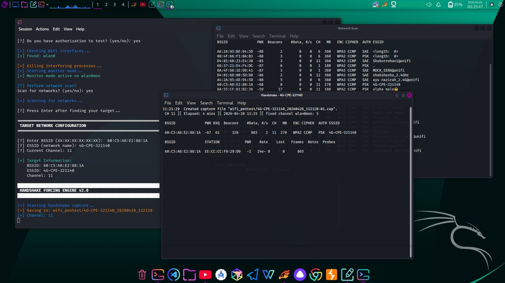

```
# SkyCrack - WiFi Security Assessment Tool


**A professional WiFi network security testing tool for authorized penetration testing and security assessments.**


## ⚠️ LEGAL DISCLAIMER

> **IMPORTANT**: This tool is designed for **educational purposes and authorized security testing only**. 
> - Only use on networks you own or have explicit written permission to test
> - Unauthorized access to computer networks is illegal in most jurisdictions
> - The author assumes no liability for misuse of this tool
> - Always comply with local laws and regulations

## 📋 Table of Contents

- [Features](#features)
- [Requirements](#requirements)
- [Installation](#installation)
- [Usage](#usage)
- [How It Works](#how-it-works)
- [Troubleshooting](#troubleshooting)
- [Contributing](#contributing)
- [Legal Notice](#legal-notice)

## ✨ Features

- **Automated WiFi Interface Detection** - Automatically identifies available wireless interfaces
- **Monitor Mode Setup** - Configures monitor mode with automatic interference handling
- **Network Scanning** - Scans and displays nearby WiFi networks
- **Client Discovery** - Identifies connected clients with signal strength analysis
- **Handshake Capture** - Captures WPA/WPA2 handshake packets
- **Multi-Method Deauth Attack** - Uses multiple deauthentication techniques
- **Password Cracking** - Integrates with aircrack-ng for password cracking
- **Automatic Cleanup** - Restores network settings after testing

## 🔧 Requirements

### System Requirements
- **Operating System**: Linux (Kali Linux, Ubuntu, Parrot OS recommended)
- **Python Version**: 3.6 or higher
- **Root Privileges**: Required for monitor mode and packet injection
- **WiFi Adapter**: Must support monitor mode and packet injection

### Required Tools
The following tools must be installed:
- `aircrack-ng` suite (airodump-ng, aireplay-ng, aircrack-ng)
- `airmon-ng`
- `iwconfig`
- `ip` command

### Installation Commands

```bash
# Ubuntu/Debian/Kali Linux
sudo apt-get update
sudo apt-get install aircrack-ng
sudo apt-get install wordlist  # For rockyou.txt wordlist

# For other distributions
sudo apt-get install aircrack-ng wireless-tools
```

## 📥 Installation

1. **Clone or download the script:**
```bash
git clone https://github.com/Falco1337/skycrack.git
cd skycrack
```

2. **Make the script executable:**
```bash
chmod +x skycrack.py
```

3. **Verify WiFi adapter supports monitor mode:**
```bash
sudo airmon-ng
```

## 🚀 Usage

### Basic Usage

```bash
# Run with root privileges (required)
sudo python3 skycrack.py
```

### Step-by-Step Process

1. **Authorization Verification**
   - You must confirm you have permission to test the network

2. **WiFi Interface Detection**
   - Tool automatically detects available wireless interfaces

3. **Monitor Mode Setup**
   - Automatically configures monitor mode
   - Kills interfering processes

4. **Network Scanning (Optional)**
   - Choose to scan for nearby networks
   - New terminal opens showing available networks
   - Note down BSSID, ESSID, and channel of target

5. **Target Configuration**
   - Enter target BSSID (format: XX:XX:XX:XX:XX:XX)
   - Enter target ESSID (network name)
   - Enter current channel number

6. **Handshake Capture**
   - Tool automatically scans for connected clients
   - Launches multi-method deauthentication attacks
   - Waits for handshake capture

7. **Password Cracking (Optional)**
   - Choose to attempt password cracking
   - Uses rockyou.txt wordlist by default

### Example Run

```bash
$ sudo python3 skycrack.py

██████████████████████████████████████████████
     SKY NETWORK SECURITY TESTING
     WiFi Security Assessment Tool
██████████████████████████████████████████████

══════════════════════════════════════════════════════════════
 LEGAL WARNING: Use only on networks you own or have
 permission to test. Unauthorized access is illegal!
══════════════════════════════════════════════════════════════

[?] Do you have authorization to test? (yes/no): yes

[+] Checking WiFi interfaces...
[+] Found: wlan0

[+] Killing interfering processes...
[+] Starting monitor mode...
[+] Monitor mode active on wlan0mon

[?] Perform network scan? (yes/no): yes

[?] Enter BSSID (XX:XX:XX:XX:XX:XX): 00:11:22:33:44:55
[?] ESSID (network name): TestNetwork
[?] Current Channel: 6

[+] Target Information:
    BSSID: 00:11:22:33:44:55
    ESSID: TestNetwork
    Channel: 6

...
```

## 🔬 How It Works

### Technical Architecture

1. **Interface Management**
   - Detects wireless interfaces using `ip addr` and `iwconfig`
   - Configures monitor mode using `airmon-ng`
   - Handles interference by killing conflicting processes

2. **Handshake Capture Process**
   ```
   Start Monitor Mode → Scan Networks → Target Selection
          ↓
   Client Discovery → Deauth Attack → Capture Handshake
          ↓
   Verify Handshake → Save CAP File → Optional Cracking
   ```

3. **Deauthentication Attack Methods**
   - **Directed Attack**: Targets specific client using `aireplay-ng --deauth 3 -c CLIENT_MAC`
   - **Broadcast Attack**: Targets all clients connected to AP
   - **Multi-wave Attack**: Multiple waves with different timing

4. **Client Detection**
   - Uses airodump-ng CSV output parsing
   - Analyzes signal strength for optimal client selection
   - Updates client list during attack for better targeting

## 🛠️ Troubleshooting

### Common Issues and Solutions

| Issue | Possible Cause | Solution |
|-------|---------------|----------|
| **No WiFi interfaces found** | Adapter not detected | Check `iwconfig`, reconnect adapter |
| **Monitor mode fails** | Driver compatibility | Use `iwconfig wlan0 mode monitor` manually |
| **No clients detected** | No active clients | Try during peak hours, move closer |
| **Handshake not captured** | Weak signal or WPA3 | Move closer, ensure WPA2 network |
| **Wordlist not found** | Missing rockyou.txt | Extract: `sudo gunzip /usr/share/wordlists/rockyou.txt.gz` |

### Debug Mode

For debugging, run individual components:
```bash
# Check monitor mode
sudo airmon-ng start wlan0
sudo iwconfig

# Manual handshake capture
sudo airodump-ng -c 6 --bssid XX:XX:XX:XX:XX:XX -w capture wlan0mon

# Manual deauth test
sudo aireplay-ng --deauth 1 -a BSSID_AP -c CLIENT_MAC wlan0mon
```

### System Optimization Tips

1. **Close unnecessary applications** - Free up system resources
2. **Position antenna properly** - For better signal reception
3. **Disable power management** - `iwconfig wlan0 power off`
4. **Use external adapter** - Built-in adapters often have limited capabilities

## 🤝 Contributing

Contributions are welcome! Please follow these guidelines:

1. **Fork the repository**
2. **Create a feature branch** (`git checkout -b feature/AmazingFeature`)
3. **Commit changes** (`git commit -m 'Add some AmazingFeature'`)
4. **Push to branch** (`git push origin feature/AmazingFeature`)
5. **Open a Pull Request**

### Development Setup

```bash
# Clone your fork
git clone https://github.com/Falco1337/skycrack.git

# Create virtual environment
python3 -m venv venv
source venv/bin/activate

# Install development dependencies
pip install pylint black
```

## 📚 Educational Resources

### Understanding WiFi Security

- **WPA/WPA2 Handshake**: Four-way handshake occurs when client connects to AP
- **Deauthentication Attack**: Forced disconnection to capture handshake
- **Monitor Mode**: Allows capturing packets without associating with AP

## 📝 Legal Notice

This tool is provided for **educational and authorized security testing purposes only**. 

**By using this software you agree to:**
- Use only on networks you own or have explicit permission to test
- Not use for any illegal activities
- Accept full responsibility for your actions
- Comply with all applicable laws

**The developer is not responsible for:**
- Any damage caused by this tool
- Any illegal use of this tool
- Any violation of network security policies

## 📄 License

This project is licensed under the Educational Use License - see the LICENSE file for details.

---

**Remember**: With great power comes great responsibility. Always test ethically and legally.

*Last Updated: November 2024*
```
